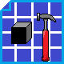

<!-- PROJECT LOGO -->
<br />
<p align="center">
  <a href="https://github.com/Yuugen64/00001_PortfolioWebsite/blob/main/README.md">
    
  </a>

  <h3 align="center">Portfolio</h3>

  </p>
</p>


<!-- TABLE OF CONTENTS -->
## Table of Contents

* [About the Project](#about-the-project)
  * [Built With](#built-with)
* [Getting Started](#getting-started)
  * [Prerequisites](#prerequisites)
  * [Installation](#installation)
* [Usage](#usage)
* [Roadmap](#roadmap)
* [Contact](#contact)
* [Acknowledgements](#acknowledgements)


<!-- ABOUT THE PROJECT -->
## About The Project

<!-- [![Product Name Screen Shot][product-screenshot]](https://example.com) -->


### Built With
* HTML
* CSS
* JavaScript - ES6


<!-- GETTING STARTED -->
## Getting Started

There is no complicated install process here. If you'd like to download the code, simply click the green button at the top righ of this section to download the zip.


### Prerequisites

There are no prerequisites to running this site!
```sh
:-)
```

### Installation

1. Click the green download button to get the .zip!


<!-- USAGE EXAMPLES -->
## Usage

To find a job!


<!-- ROADMAP -->
## Roadmap

See the [open issues](https://github.com/Yuugen64/00001_PortfolioWebsite/issues) for a list of proposed features (and known issues).


<!-- CHANGELOG -->
## Changelog:

11.3.20:
- Set up the repository and the core framework for the site.

### Main Branch:

11.3.20:
- [001-0.0.1]: Added the core layout of the site and followed an excellent guide by othneildrew on Github to better organize my Readme.
- [002-0.0.1]: Readme Formatting >> Tweaked the formatting for the readme, since the markdown didn't work quite as expected on the first try.
- [003-0.0.2]: Layout + Prestyle >> Configured the global CSS grid (trying a different approach this time) and added the basic styling elements for the mobile version."
- [004-0.0.2]: Fixing Mobile Grid >> Trying to seperate the global grid out into areas that make sense for the overall flow for the website.
- [005-0.0.3]: Fixed intro area for mobile >> Used a sub-grid for the intro so that it has its own unique styling irrespective of the global-grid. Added a fourth CSS page for the smaller styling changes for the website."


<!-- CONTRIBUTING -->
## Contributing

For this particular project, there have been no outside contributions. If that changes in the future I will be sure to update this seciton to accurately credit those authors.


<!-- CONTACT -->
## Contact

Andrew Babler - Yuugen64@protonmail.com

Project Link: [https://github.com/Yuugen64/00001_PortfolioWebsite/issues](https://github.com/Yuugen64/00001_PortfolioWebsite/issues)


<!-- ACKNOWLEDGEMENTS -->
## Acknowledgements
* [Othneildrew](https://github.com/othneildrew/Best-README-Template/blob/master/README.md) - For providing a great template for leveling up my README!

